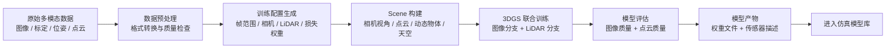
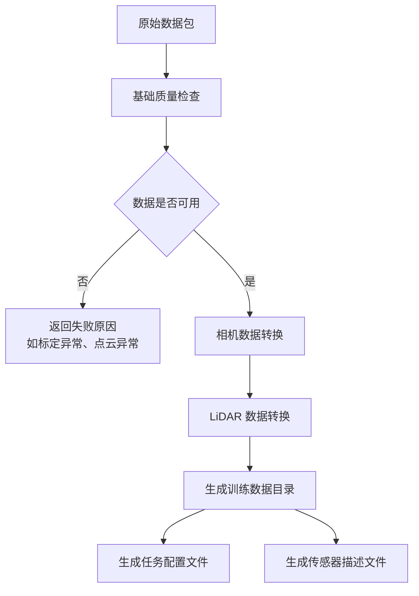
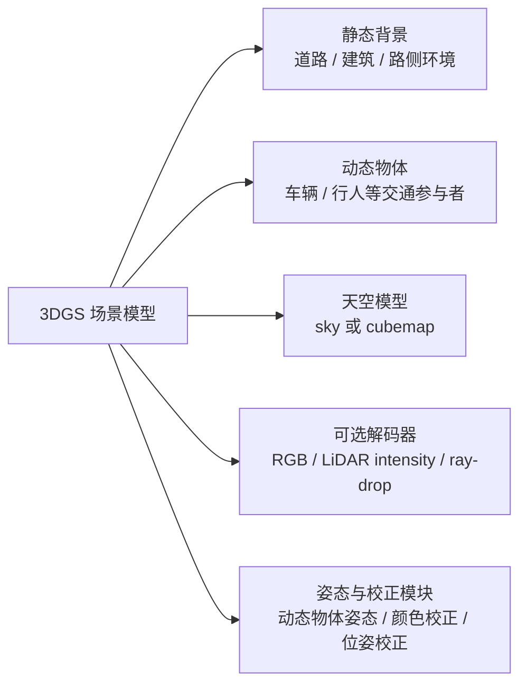
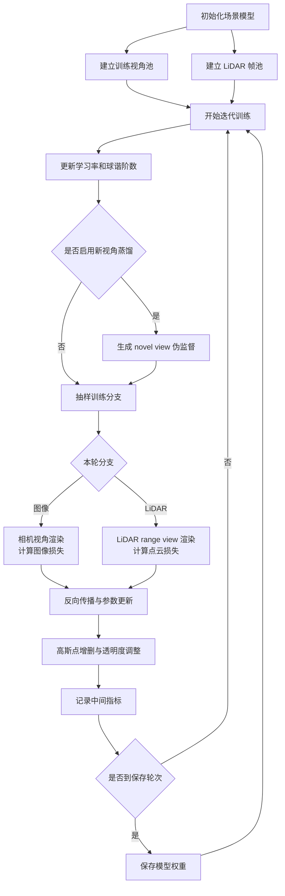
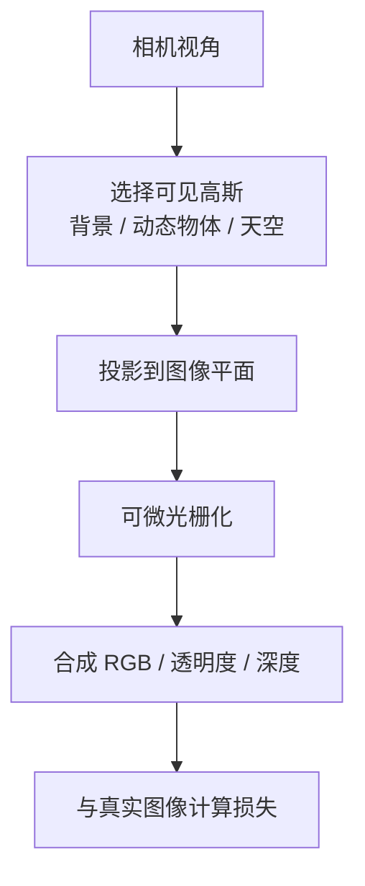
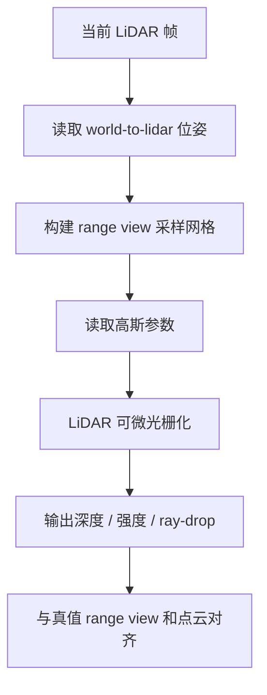
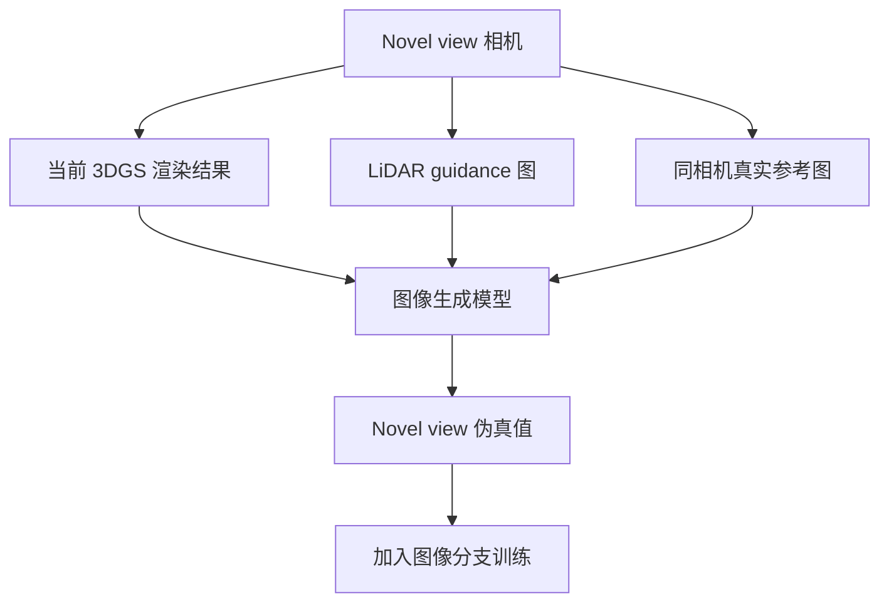
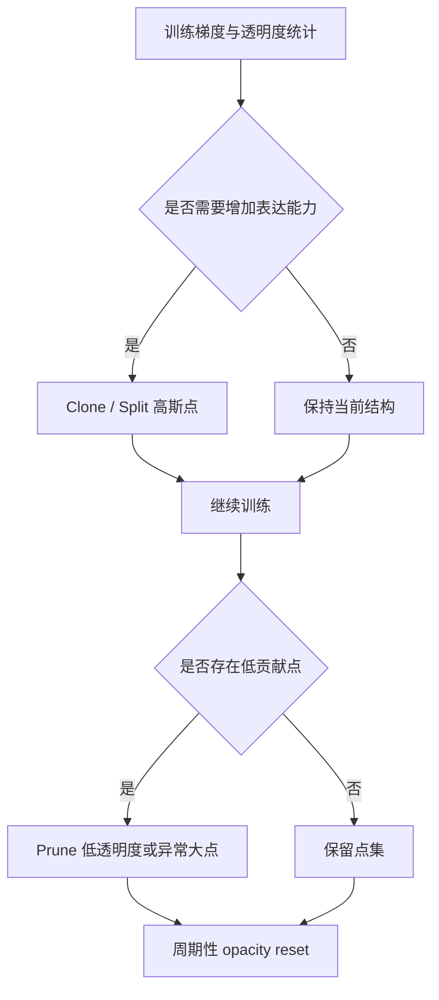
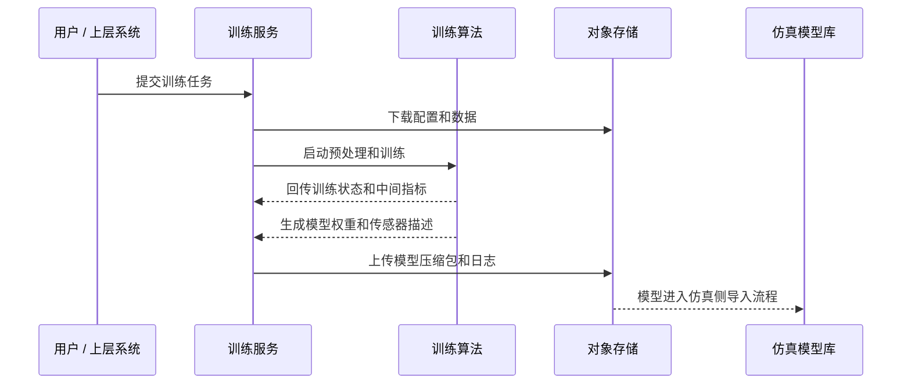
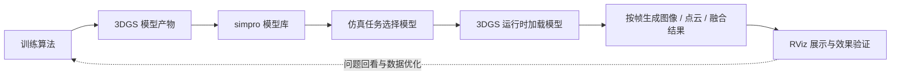

# 3DGS 训练算法说明

## 1. 文档定位

本文面向训练平台和闭环仿真方案的汇报展示，重点说明 3DGS 模型训练算法的业务价值、技术路线和产物形态。平台侧负责训练任务管理，算法侧负责从多模态数据中学习可用于仿真的三维场景模型，两者通过模型产物完成解耦。

训练算法的目标不是单独生成一段视频或一张点云，而是生成一个可被仿真系统加载的 3DGS 场景模型。模型需要同时支持相机视角渲染、激光雷达结果生成，以及后续在仿真闭环中的传感器复用。

<!-- more -->

## 2. 总体思路

本训练方案采用“图像监督 + LiDAR 监督 + 动态场景建模”的联合训练路线。图像数据提供外观、纹理和视角一致性约束，LiDAR 数据提供空间几何、深度和点云回波约束，动态物体轨迹用于保持交通参与者在时间维度上的一致性。

从汇报角度看，可以把算法理解为三个层次：

| 层次 | 作用 |
| --- | --- |
| 数据层 | 把原始采集数据整理成训练可直接消费的标准数据 |
| 表达层 | 用 3D Gaussian 表达道路、静态背景、天空和动态物体 |
| 优化层 | 通过图像和 LiDAR 双重监督，不断调整高斯点的位置、尺度、颜色、透明度和回波特征 |

## 3. 输入与输出

训练输入包括两部分：训练数据包和训练配置。训练数据包提供场景本身，训练配置决定训练范围、传感器选择和优化策略。

| 类型 | 主要内容 | 作用 |
| --- | --- | --- |
| 图像数据 | 多相机图像、相机内外参、车辆位姿 | 监督模型的外观、颜色和视角一致性 |
| LiDAR 数据 | 点云、雷达内外参、线束参数、强度信息 | 监督模型的空间结构、深度、回波强度和 ray-drop |
| 场景数据 | 地图文件、场景文件、动态物体轨迹 | 支撑模型产物进入仿真侧使用 |
| 训练配置 | 帧范围、相机编号、迭代次数、损失权重、GPU 选择 | 控制本次训练任务的规模和目标 |

训练输出是面向仿真闭环的模型包，主要包含：

| 输出 | 说明 |
| --- | --- |
| 3DGS 模型权重 | 保存训练后的高斯场、动态物体、天空、解码器等参数 |
| 传感器描述文件 | 描述模型对应的相机、LiDAR、地图和场景信息 |
| 训练日志 | 记录训练状态、显存、损失和评估指标 |
| 模型压缩包 | 作为训练平台向仿真模型库交付的统一产物 |

## 4. 数据预处理

预处理阶段的核心任务是把原始数据整理成统一格式，并尽早发现明显的数据问题。这里不会改变训练算法目标，但会直接影响训练是否稳定。

基础质量检查主要覆盖三类问题：

- 相机标定是否合理，例如主点是否落在图像范围内，外参旋转矩阵是否接近正交。
- 车辆位姿是否合理，避免位姿矩阵异常导致整段场景错位。
- 点云文件是否可用，避免空点云、非法坐标、无效字段或数值发散进入训练。

相机转换会生成训练所需的图像、标定、动态 mask、sky mask、稀疏深度等数据。LiDAR 转换会生成每帧点云、雷达标定、线束参数、点云元信息和 range view 相关输入。

预处理完成后，会形成一次训练专用的配置文件。该配置文件把平台侧传入的业务参数转换成算法侧需要的训练参数，包括：

| 参数类型 | 示例 |
| --- | --- |
| 数据范围 | 起止帧、参与训练的相机 |
| 模型结构 | 是否启用 RGB decoder、LiDAR MLP、天空模型、MCMC 策略 |
| 优化目标 | 图像损失、LiDAR 深度损失、强度损失、ray-drop 损失等权重 |
| 传感器参数 | LiDAR 方位角、俯仰角、线数、最大深度、tile 大小 |
| 产物路径 | 模型输出目录、日志目录、仿真传感器描述 |

## 5. 场景表达

算法采用 Street Gaussian 的表达方式，将一个交通场景拆成若干部分分别建模，再在渲染时组合起来。

每个高斯点可以看作场景中的一个局部可微椭球。它包含位置、形状、方向、透明度和特征，训练过程会持续优化这些参数。

用数学形式可以概括为：

$$
G_i = \left(\mu_i,\; s_i,\; q_i,\; \alpha_i,\; f_i\right)
$$

其中：

| 符号 | 含义 |
| --- | --- |
| $\mu_i$ | 第 $i$ 个高斯点的三维位置 |
| $s_i$ | 三轴尺度 |
| $q_i$ | 旋转四元数 |
| $\alpha_i$ | 不透明度 |
| $f_i$ | 颜色、球谐或 LiDAR 相关特征 |

动态物体采用“局部模型 + 帧间位姿”的方式表达。也就是说，同一辆车的外观和几何由一组局部高斯描述，训练时再根据当前帧的轨迹位姿放到世界坐标中。这样可以避免把同一物体在不同帧重复建模，有利于稳定动态场景。

## 6. 联合训练目标

训练目标可以概括为一个多项加权优化问题：

$$
\mathcal{L}
= \lambda_{\text{img}}\mathcal{L}_{\text{img}}
+ \lambda_{\text{lidar}}\mathcal{L}_{\text{lidar}}
+ \lambda_{\text{reg}}\mathcal{L}_{\text{reg}}
+ \lambda_{\text{novel}}\mathcal{L}_{\text{novel}}
$$

其中：

| 项 | 说明 |
| --- | --- |
| $\mathcal{L}_{\text{img}}$ | 图像渲染损失，用于约束视觉效果 |
| $\mathcal{L}_{\text{lidar}}$ | LiDAR 损失，用于约束几何和回波特征 |
| $\mathcal{L}_{\text{reg}}$ | 正则项，用于控制天空、地面、动态物体、点云规模等 |
| $\mathcal{L}_{\text{novel}}$ | 可选的新视角蒸馏损失，用于提升未采集视角的泛化能力 |

这类联合目标的好处是：图像分支补足纹理和细节，LiDAR 分支补足空间结构。两者同时约束时，模型更适合进入仿真闭环，而不是只服务于单一的视觉重建。

## 7. 训练主流程

训练过程以迭代方式进行。每一轮会在图像分支和 LiDAR 分支之间抽样选择一个方向进行优化，然后更新模型参数，并在指定轮次做评估和保存。

训练过程中，模型会经历两个变化：

- 连续参数优化：调整位置、尺度、旋转、透明度、颜色和回波特征。
- 结构动态调整：根据梯度和透明度增删高斯点，使模型容量逐步匹配场景复杂度。

## 8. 图像分支

图像分支负责让模型在相机视角下看起来正确。训练时，模型会从当前相机位姿出发，渲染出预测图像 $\hat{I}$，并与真实图像 $I$ 对齐。

基础图像损失为：

$$
\mathcal{L}_{\text{img}}
= (1-\lambda_{\text{ssim}})\left\|\hat{I}-I\right\|_1
+ \lambda_{\text{ssim}}\left(1-\text{SSIM}(\hat{I}, I)\right)
$$

其中，$\left\|\hat{I}-I\right\|_1$ 约束像素级误差，$\text{SSIM}$ 约束结构相似度。二者结合后，既关注颜色误差，也关注局部结构和边缘质量。

除基础图像损失外，图像分支还会根据数据情况叠加辅助约束：

| 约束 | 目的 |
| --- | --- |
| 天空约束 | 避免天空区域被道路或物体高斯错误占用 |
| 地面约束 | 提升道路平面和地面区域的稳定性 |
| 动态物体透明度约束 | 控制动态物体区域的高斯分布，减少拖影 |
| 稀疏 LiDAR 深度约束 | 用点云投影深度补强几何一致性 |
| 颜色校正规则项 | 避免颜色校正模块过度补偿 |

## 9. LiDAR 分支

LiDAR 分支负责让模型在激光雷达视角下生成合理的深度、强度和射线返回状态。与图像分支不同，LiDAR 分支按方位角和俯仰角组织输出，结果更接近 range view。

LiDAR 分支的损失主要包括三类。

### 9.1 深度损失

深度损失约束预测深度 $\hat{D}$ 和真实深度 $D$ 的差异：

$$
\mathcal{L}_{\text{depth}}
= \lambda_{\text{depth}}
\cdot
\frac{1}{|\Omega|}
\sum_{p\in\Omega}
\left|\hat{D}_p-D_p\right|
$$

$\Omega$ 表示有效返回点集合。训练中会过滤掉明显异常的误差点，减少少量噪声点对整体几何的影响。

### 9.2 强度损失

强度损失约束预测回波强度 $\hat{R}$ 和真实强度 $R$：

$$
\mathcal{L}_{\text{intensity}}
= \lambda_{\text{intensity}}
\cdot
\frac{1}{|\Omega|}
\sum_{p\in\Omega}
\left(\sigma(\hat{R}_p)-R_p\right)^2
$$

这里的 $\sigma(\cdot)$ 表示 Sigmoid，将预测强度压到稳定范围内。

### 9.3 Ray-drop 损失

Ray-drop 表示某条射线是否没有有效返回。该项用二分类交叉熵建模：

$$
\mathcal{L}_{\text{drop}}
= \lambda_{\text{drop}}
\cdot
\text{BCEWithLogits}(\hat{Y}, Y)
$$

其中 $\hat{Y}$ 是模型预测的未返回 logits，$Y$ 是真实 ray-drop 标签。

LiDAR 总损失可写为：

$$
\mathcal{L}_{\text{lidar}}
= \mathcal{L}_{\text{depth}}
+ \mathcal{L}_{\text{intensity}}
+ \mathcal{L}_{\text{drop}}
+ \mathcal{L}_{\text{los}}
$$

$\mathcal{L}_{\text{los}}$ 是可选的视线约束，用来抑制目标点前方过高的不透明度，使 LiDAR 射线传播更符合物理直觉。

## 10. 新视角蒸馏

当开启新视角蒸馏时，训练过程会为部分 novel view 生成伪监督图像。其目的不是替代真实数据，而是在真实采集视角之外补充一些横向偏移或新轨迹视角，从而提升模型在仿真中被不同传感器配置复用时的稳定性。

新视角损失可以表示为：

$$
\mathcal{L}_{\text{novel}}
= \lambda_{\text{novel}}
\left[
(1-\lambda_{\text{nssim}})\lambda_{\text{nl1}}\left\|\hat{I}^{n}-I^{n}\right\|_1
+\lambda_{\text{nssim}}\left(1-\text{SSIM}(\hat{I}^{n}, I^{n})\right)
+\lambda_{\text{lpips}}\text{LPIPS}(\hat{I}^{n}, I^{n})
\right]
$$

其中 $I^{n}$ 表示 novel view 的伪真值，$\hat{I}^{n}$ 表示模型在该视角下的渲染结果。训练时会更关注图像下半部分区域，因为道路、车辆和可行驶区域对仿真验证更关键。

## 11. 高斯点自适应调整

3DGS 训练过程会动态调整高斯点数量。静态地训练一批固定点，通常很难同时兼顾近处物体细节和远处背景覆盖。因此算法会根据训练信号进行增点、删点和透明度重置。

默认策略是 ADC，即根据二维投影梯度和可见性统计进行增删点。其直观含义是：如果某些区域误差大且梯度明显，就给模型更多局部表达能力；如果某些点长期透明或尺度异常，就把它们删掉。

在开启 MCMC 策略时，背景点会采用更适合大场景的采样式调整：

$$
N_{\text{new}}=\min(N_{\text{cap}},\;1.05N)-N
$$

其中 $N$ 为当前背景高斯点数量，$N_{\text{cap}}$ 为点数上限。新增点按不透明度分布采样，低贡献点会被搬移到高贡献区域附近。这种方式可以改善大范围道路场景中背景点分布不均的问题。

## 12. 评估指标

评估分为图像质量和 LiDAR 质量两类。图像指标反映相机渲染效果，LiDAR 指标反映几何和点云输出质量。

### 12.1 图像指标

图像侧主要使用 PSNR、SSIM 和 L1。

$$
\text{PSNR}
=10\log_{10}\left(\frac{MAX_I^2}{\text{MSE}}\right)
$$

PSNR 越高，表示像素误差越小；SSIM 越高，表示结构相似度越好。

### 12.2 LiDAR 指标

LiDAR 侧主要关注点云几何和 range view 质量。

Chamfer Distance 用于衡量预测点云 $\hat{P}$ 与真值点云 $P$ 的距离：

$$
\text{CD}(\hat{P},P)
=
\frac{1}{|\hat{P}|}\sum_{\hat{p}\in\hat{P}}\min_{p\in P}\|\hat{p}-p\|_2^2
+
\frac{1}{|P|}\sum_{p\in P}\min_{\hat{p}\in\hat{P}}\|p-\hat{p}\|_2^2
$$

F1-score 用于衡量预测点与真值点在距离阈值内的匹配情况：

$$
\text{F1}
=
\frac{2\cdot \text{Precision}\cdot \text{Recall}}
{\text{Precision}+\text{Recall}}
$$

此外还会统计深度和强度的 PSNR、SSIM、LPIPS、RMSE、MedAE 等指标，用于观察 range view 层面的质量。

## 13. 训练状态与产物交付

训练过程会持续向平台侧回传状态和指标。平台不直接参与每轮优化，但会承接任务生命周期管理。

训练完成后的交付物包括模型权重、传感器描述和日志。模型权重供 3DGS 运行时加载，传感器描述供 simpro 侧识别相机和 LiDAR 参数，日志和指标供效果复盘。

## 14. 与闭环仿真的关系

训练算法在整体闭环中承担“模型生产”角色。它不直接控制仿真帧，也不参与 RViz 展示；它的职责是把一段真实采集数据训练成可复用的 3DGS 模型。

这条链路的价值在于：训练结果可以快速进入仿真验证，仿真结果又能反向指导下一轮数据准备和模型训练。训练算法因此不再是孤立工具，而是闭环仿真能力的一部分。

## 15. 汇报要点

| 要点 | 说明 |
| --- | --- |
| 多模态联合 | 同时利用图像和 LiDAR 监督，兼顾视觉真实感和空间几何 |
| 动态场景建模 | 对背景、天空和动态物体分开建模，适配交通场景 |
| 可仿真交付 | 输出模型权重和传感器描述，可进入 simpro 模型库 |
| 可过程追踪 | 训练状态、中间指标、最终指标和日志可查询 |
| 可持续迭代 | 仿真验证结果可反向指导下一轮数据和模型优化 |

整体来看，该训练算法的作用是把真实场景数据转化为可在闭环仿真中复用的 3DGS 传感器模型，为后续相机、LiDAR 和融合传感器的仿真验证提供统一模型基础。
